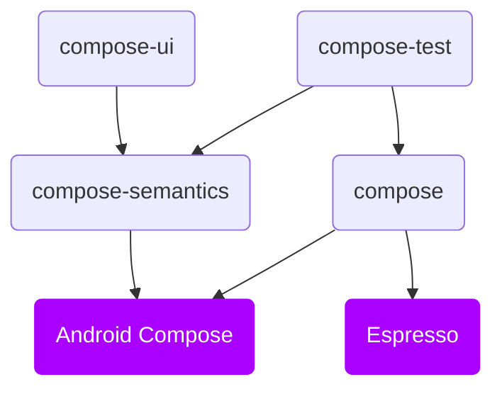

# Structure

### **Overview**

From version `1.0.0` Kakao Compose contains four main modules, with following dependencies

### **Core**
* `compose` - Core module, which providing DSL wrapping for Espresso methods, `ComposeScreen` page objects and `KNode` and list support. Version 1+ is mostly compatible with version 0+ and required minimum effort for migration.

Can be added `implementation("io.github.kakaocup:compose:1.0.0")`

### **Optional**

UI testing presents distinct approaches for XML and Compose implementations. A core concept in Compose is the use of Nodes, which are not type-based. 
This introduces certain limitations in UI test development, such as the inability to perform type checks on views. The only way to retrieve states from a view is through `Semantic` providers. 
In the Kakao Compose version, we identified an issue where developers attempted to add custom semantics to the core library, which detracted from its role as a "pure Espresso wrapper."
To address this, we opted for an extension libraries approach instead.
  
#### `compose-semantics`  
Set of default semantics keys, what can be used by `compose-ui` and `compose-test` modules. This module is very lightweight and contains only set of semantics which used in `compose-test` to identify state of the view.
Need to be added explicitly only in case of having design system and avoiding direct dependency on `compose-ui`

Can be added `implementation("io.github.kakaocup:compose-semantics:1.0.0")`

:::tip If you have a design system in your project

You can add all required parameters to your design system based matching from [compose-ui](https://github.com/KakaoCup/Compose/tree/master/compose-ui/src/main/kotlin/io/github/kakaocup/compose/foundation) to avoid transitive dependency on Compose via Kakao

:::

#### `compose-ui`
Wrapped over Compose base components, with the same constructors declaration. 
Those wrappers will set all possible semantics from `compose-semantics` module, which can be used by `compose-test` module. This module is for quick adding type based checks into your application

:::warning Compose transitive dependency

By adding this module it will create non-directive dependency on project compose version. And your compose components can be out date, however we will try to release a new version in case of Compose version update.

:::

To avoid transitive dependency via Kakao Compose you may just copy source code of `compose-ui` into your project and add dependency just to `compose-semantics`

Can be add `implementation("io.github.kakaocup:compose-ui:1.0.0")`

#### `compose-test`
Providing nodes for typed component validation such as `KButtonNode`, `KIconNode`, `KProgresBar` and etc.

Can be added `testImplementation("io.github.kakaocup:compose-test:1.0.0")`

Examples of usage can be found in [Sample project](https://github.com/KakaoCup/Compose/tree/master/sample/src/androidTest/java/io/github/kakaocup/compose/test/node)
