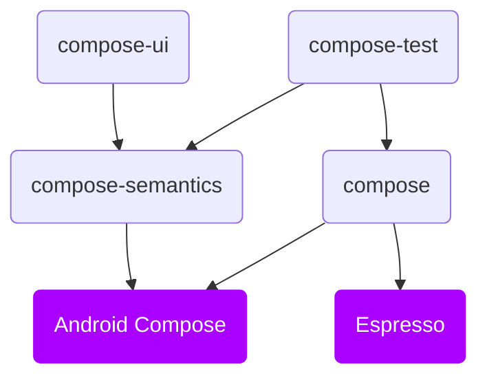

# Structure

### **Overview**

Starting with version `1.0.0`, Kakao Compose is organized into four primary modules, with the following dependency structure:

### **Core**
#### `compose`
The foundational module that provides a DSL wrapper for Espresso methods, `ComposeScreen` page objects, and support for `KNode` and lists. Version 1+ maintains broad compatibility with version 0+, requiring minimal effort to upgrade.

Add it with: `implementation("io.github.kakaocup:compose:1.0.0")`

### **Optional**

UI testing differs significantly between XML and Compose approaches. A key aspect of Compose is its reliance on Nodes, which lack type specificity. This creates challenges in UI test creation, such as the inability to perform type-based checks on views. View states can only be accessed via `Semantic` providers. In earlier versions of Kakao Compose, developers often tried to embed custom semantics in the core library, which undermined its purpose as a simple Espresso wrapper. To resolve this, we shifted to an extension-based library model.

#### `compose-semantics`
A collection of default semantic keys utilized by the `compose-ui` and `compose-test` modules. This lightweight module includes only the semantics necessary for `compose-test` to determine view states. It should be added explicitly only if you’re using a design system and wish to avoid depending directly on `compose-ui`.

Add it with: `implementation("io.github.kakaocup:compose-semantics:1.0.0")`

:::tip For projects with a design system

You can integrate all necessary parameters into your design system by referencing the mappings in [compose-ui](https://github.com/KakaoCup/Compose/tree/master/compose-ui/src/main/kotlin/io/github/kakaocup/compose/foundation), avoiding a transitive dependency on Compose through Kakao.

:::

#### `compose-ui`
A wrapper around Compose’s foundational components, mirroring their constructor signatures. These wrappers apply all applicable semantics from the `compose-semantics` module, enabling the `compose-test` module to leverage them. This module simplifies adding type-specific checks to your app.

:::warning Transitive Compose dependency

Including this module introduces an indirect dependency on your project’s Compose version. This could lead to outdated components, though we aim to release updates aligned with new Compose versions.

:::

To bypass transitive dependencies via Kakao Compose, you can copy the `compose-ui` source code into your project and depend solely on `compose-semantics`.

Add it with: `implementation("io.github.kakaocup:compose-ui:1.0.0")`

#### `compose-test`
Offers nodes for validating typed components, such as `KButtonNode`, `KIconNode`, `KProgressBar`, and more.

Add it with: `testImplementation("io.github.kakaocup:compose-test:1.0.0")`

Usage examples are available in the [Sample project](https://github.com/KakaoCup/Compose/tree/master/sample/src/androidTest/java/io/github/kakaocup/compose/test/node).
