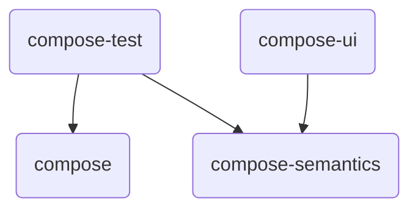

# Introduction

Welcome to **Kakao Compose** tutorial. Let's make UI testing easies and simple. In this documentation we will try to explain functionality of Kakao Compose and
fundamental concepts of implementation, modules and responsibility of each, how to add this library to your project and
how to start works on UI test step by step.

But before we started, don't forget that `KakaoCup` is fully Open Source and supported by community. 
Please don't hesitate to contribute to this documentation or fix any bugs. 
We always welcome to new contributors with any level of codding skills.

### Overview

From version `1.0.0` Kakao Compose contains four main modules, with following dependencies

* Core
  * `compose` - Core module, which providing DSL wrapping for Espresso methods, `ComposeScreen` page objects and `KNode`

* Extra
  * `compose-semantics` - Set of default semantics keys, what can be used by `compose-ui` and `compose-test` modules
  * `compose-ui` - Wrapped over Compose base components, with the same constructors signatures. 
  Those wrappers will set all possible semantics from `compose-semantics` module, which can be used by `compose-test` module
  * `compose-test` - Providing nodes for typed component validation
